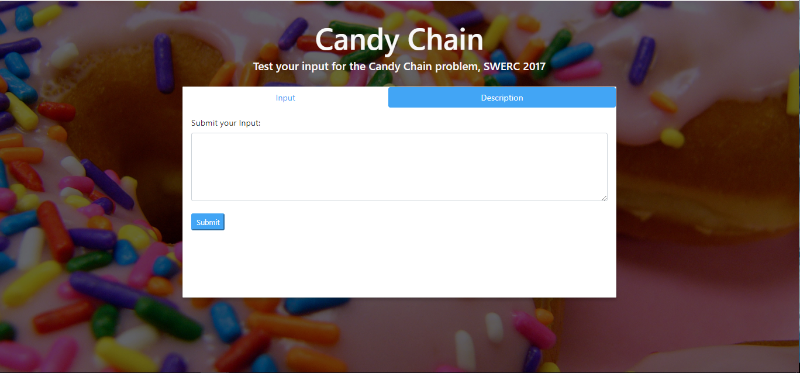

# Test oracle for candy chain
A simple Angular frontend that serves as a test oracle for competitive programming programs, in particular, candy chain (problem D, SWERC 2017).



This project was done as an academic project for the Software Quality and Dependability class of University of Coimbra with Gonçalo Lopes and Paulo Cruz.

## 1 - Getting started
 1. Clone this repository into your computer.
 2. Install Node.js
 2. Install npm.
 3. Install ng-cli `npm install -g @angular/cli`.
 4. Run the command `npm install` inside the project directory.
 5. Install `npm install --save bootstrap@4.0.0-beta.2 font-awesome`
 6. To build and start this application, run the command `ng serve --open` inside the project directory.
 7. Use your favourite browser to access `http://localhost:4200/`

## Further considerations
This project expects a working backend that computes the correct answer for the considered problem.
Change the backend here:
```
\src\app\services\httprequest.service.ts
```